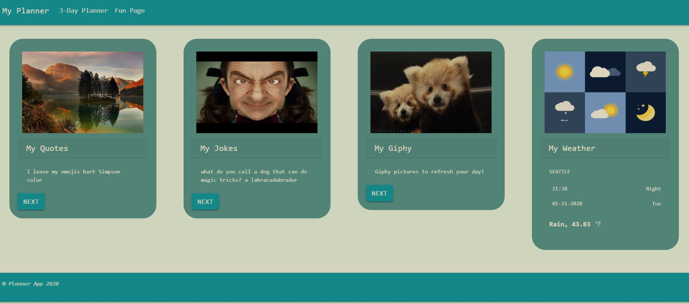

# Planner App

## Overview

A react based Planner App for people who loves to plan their day with a three day approach , yet have fun at the same time with the fun page with giphy, quotes to inspire your day , weather information and jokes to cheer your day while you do your tasks.

Planner App is hosted on Heroku. Check it out live:
https://project-3-planner-app.herokuapp.com/

## How It Works

The user has access to two pages: Three Day Planner and Fun Page

| Three Day Planner                     | Fun Page                                      |
| ------------------------------------- | --------------------------------------------- |
| Adds the three day planner TODO       | Renders all axios calls in each card          |
| Gives the time remaining for the TODO | Another API data can be seen with next button |
| Save TODO to the Mongo database       | Gives the weather details with date and time  |

## Installation

```
To run this application locally, use http://localhost:3000 after completing the following steps.

- git clone
- npm install
- npm start

NOTE: Facebook's command to install a react app is `npx create-react-app` NOT `npm create-react-app`

```

## Motivation:

1. Organize a day more meaningfully
2. Organize priorities by today/ tomorrow/ day-after tomorrow
3. Organise with time frame
4. Be inspired &
5. Prioritize fun!

## Technologies used

| Client dependencies          | Planner App dependencies |
| ---------------------------- | ------------------------ |
| React                        | Express                  |
| React router dom             | Node                     |
| React-scripts                | Mongoose                 |
| React-bootstrap, react-icons | cors                     |
| React Simple Storage         | concurrently             |  |
| Axios                        | if-enve                  |
| Materialize-css              |                          |

# API used

- Open Weather API
- Dad Jokes API
- Giphy API
- Kanye API

## Screenshots




## Contributing

- Pull requests are welcome. For major changes, please open an issue first to discuss what you would like to change.

## Credits

```
The Coding Bootcamp @ University of Washington

```

## License

[MIT](https://choosealicense.com/licenses/mit/)

## Copyright

Copyright (c) [2020][planner app]
